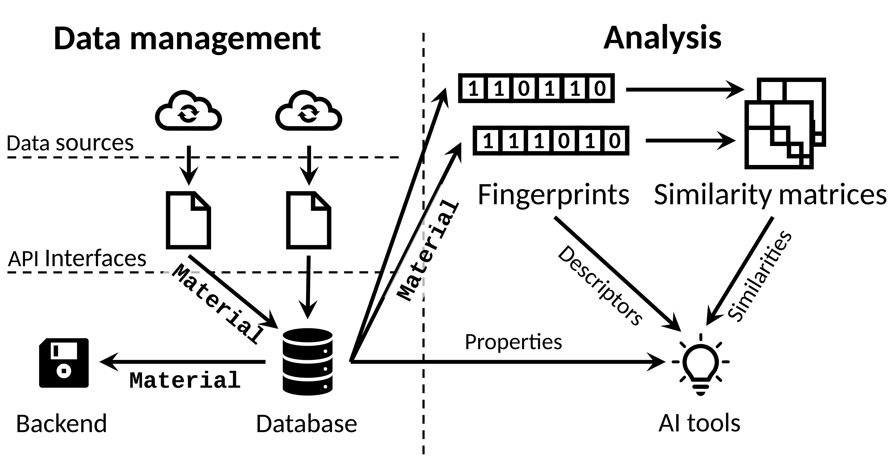

.. _about:

About this package
===================================

`MADAS` is a Python framework for computing similarities between materials.

It is written out of the need to simplify the analysis of materials data from various (or changing) sources 
and simplifies data analytics tasks such as similarity searches or clustering and enhances reproducibility.

The figure below presents an overview of the framework structure. 

The left side of the figure shows data-managements related components: External APIs can be queried using 
:doc:`API Interfaces </modules/API>`. Despite the built-in classes, it is easy to define new API Interfaces,
which will be compatible with the rest of the framework.

Data from the API Interfaces will be output as :doc:`Material objects </modules/material>`, which are used
as a consistent way of exchanging data between `MADAS` components. They contain a unique identifier, the
Material IDentifier (*mid*), the atomic structure (if available) as an 
`ASE Atoms object <https://wiki.fysik.dtu.dk/ase/ase/atoms.html>`_, and material data and properties.

The :doc:`database </modules/data_framework>` is used to interact with data. To do so, it receives
data from `API` Interfaces and writes them to a :doc:`backend </modules/backend>`. The latter is responsible
for the physical storage of data, *e.g.*, on a hard drive. Currently, :doc:`a relational database </backends/ase_backend>` 
using the `ASE AtomsDatabase <https://wiki.fysik.dtu.dk/ase/ase/db/db.html>`_ is implemented, as well as a simple,
:doc:`Python-dictionary based storage </backends/dict_backend>`.

Material objects from the database can be used to generate :doc:`Fingerprints </modules/fingerprint>`, 
which are the combination of a *descriptor* of a material and a *similarity measure*. New types of fingerprints
can be defined quickly using the ``Fingerprint`` base class.

Fingerprints can be used to calculate :doc:`similarity matrices </modules/similarity>`. These store the
similarity scores between materials and their respective *mid*. The calculation of similarities using
the ``SimilarityMatrix`` class is parallelized over all available CPU cores by default and computes only
unique entries in the matrix. Very large matrices can be computed using the ``BatchedSimilarityMatrix``,
which allows to parallelize the computation of similarities over HPC clusters, currently supporting the 
`SLURM <https://slurm.schedmd.com/documentation.html>`_ resource manager.

Additional AI tools for :doc:`clustering </modules/clustering>` and :doc:`data analysis </modules/analysis>`
are available and optimized for the usage with ``Fingerprint`` and ``SimilarityMatrix`` objects. 
